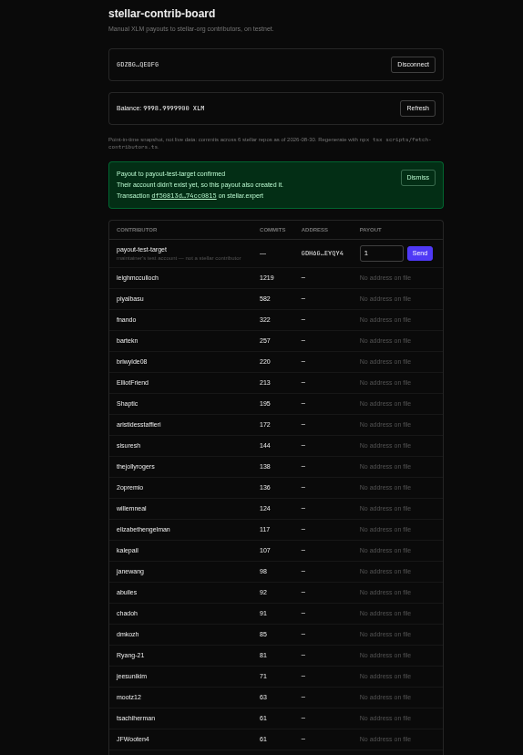
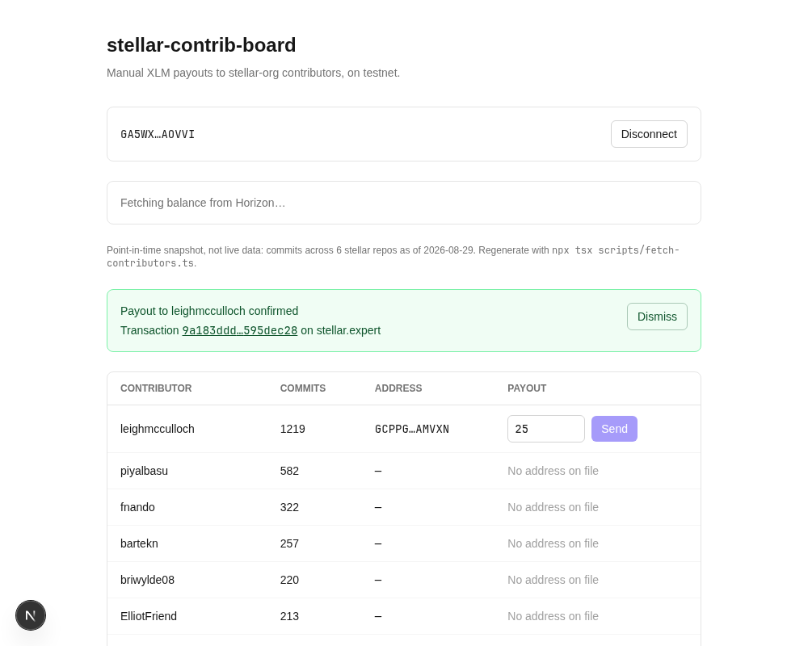
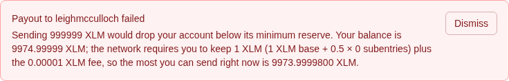
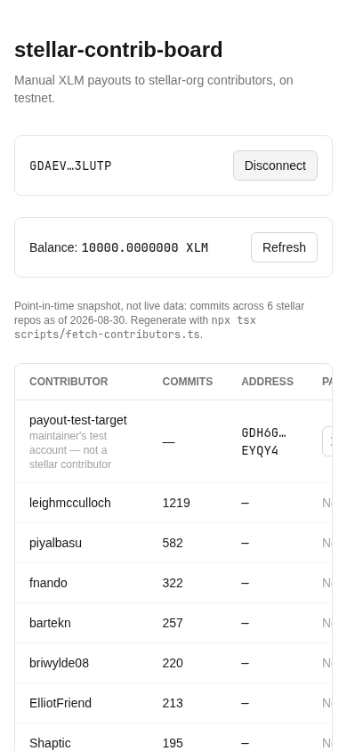
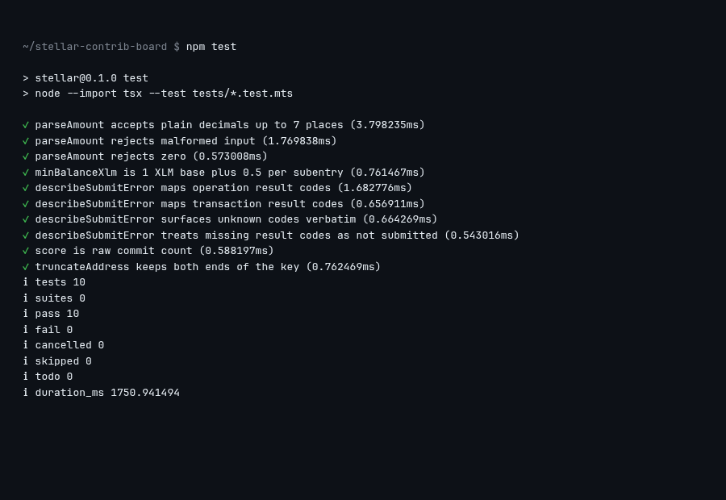
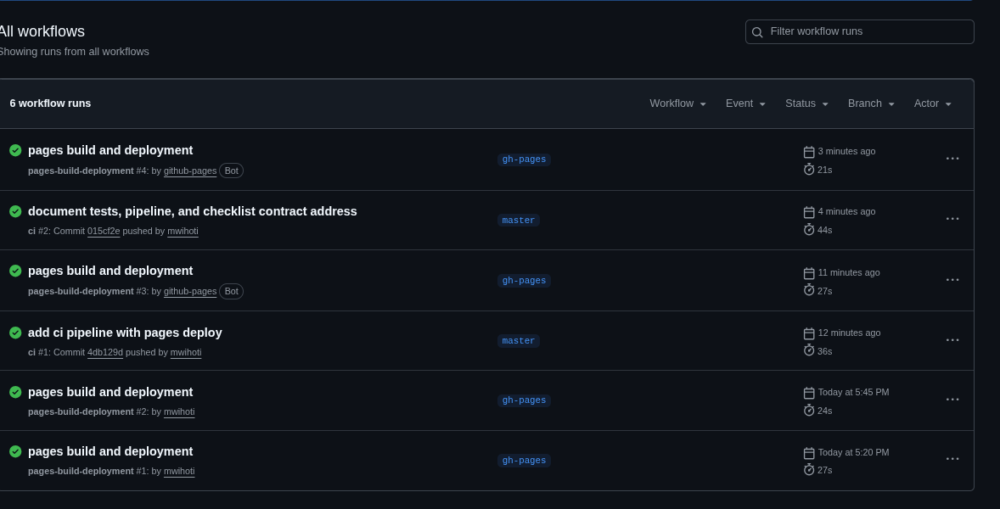

# stellar-contrib-board

A leaderboard of contributors to the [github.com/stellar](https://github.com/stellar)
org where the connected wallet holder can send an XLM payout to any listed
contributor, on the Stellar **testnet**. Built for a Level 1 "White Belt"
challenge: the point of the project is the wallet integration and error
handling, not the GitHub data.

Live at https://mwihoti.github.io/stellar-contrib-board/ (you'll need the
Freighter extension on Testnet to do anything beyond reading the board).
Demo video: https://canva.link/gul93rr99cajuxw

Be clear about what this is: **payouts are manual and rest entirely on the
judgment of whoever holds the wallet**. Nothing here is automated, trustless,
or decentralized — it is one person clicking Send.

## Stack

Next.js (App Router) + TypeScript + Tailwind, with
[`@stellar/stellar-sdk`](https://www.npmjs.com/package/@stellar/stellar-sdk)
and [`@stellar/freighter-api`](https://docs.freighter.app). No backend, no
database.

## Local setup

1. Install the [Freighter](https://www.freighter.app/) browser extension,
   create/unlock a wallet, and switch its network to **Test Net** (the app
   blocks sending on any other network and will not switch it for you).
2. ```bash
   npm install
   npm run dev
   ```
3. Open http://localhost:3000, connect, and — if your test account is new —
   use the **Fund with Friendbot** button the app offers.
4. To actually send a payout, use the labeled "payout-test-target" row at the
   top of the board — it pays the maintainer's own test account, and exists so
   the flow can be tried without inventing a contributor's address. No real
   contributor addresses ship with this repo (see Limitations). To pay a
   different account, map any login to a testnet account **you** control in
   `data/addresses.json`:
   ```json
   { "some-login-from-the-board": "G...your-second-test-account" }
   ```

## Screenshots

The full flow on the live deployment, captured by hand with the real Freighter
extension: connected wallet, balance after the send, and a confirmed payout
([this transaction](https://stellar.expert/explorer/testnet/tx/df50813dddf5a25d52a946de942e138d8049078aa61064c9898330c674cc0815))
that also created the destination account, since it didn't exist yet:



The close-ups below show the individual states.

Connected state (truncated address; disconnect is app-side only — Freighter
has no programmatic disconnect, so the site stays on its allow list until you
remove it in the extension's settings):


Balance fetched from Horizon testnet:


A successful testnet payout, with the transaction hash linked to
stellar.expert ([this exact transaction](https://stellar.expert/explorer/testnet/tx/9a183dddc22caa58f400fc45fb07084a8c7cd1cc0e1c23039696bbd7595dec28)):



What the user sees when a send is blocked — here the minimum-balance reserve
check, enforced client-side before anything is signed:



The layout on a phone-sized viewport (390px) — the panels stack and the table
scrolls horizontally:



How the close-ups were captured: `scripts/screenshots.mts` drives the real
app in headless Chromium with a stub that answers `@stellar/freighter-api`'s
messaging protocol using a throwaway testnet keypair (the extension popup
can't run headless). The app code is unaware of the stub, every state shown is
a real app state, and both payouts pictured on this page are real testnet
transactions. For the harness run, `leighmcculloch` was temporarily mapped to
a throwaway test address — see Limitations.

## Deploying

The app is a static export (`output: "export"`). The GitHub Pages deployment
is built with `DEPLOY_TARGET=pages npm run build` (which sets the
`/stellar-contrib-board` base path) and the `out/` directory pushed to the
`gh-pages` branch.

## Contribution data

- `scripts/fetch-contributors.ts` snapshots commit counts from the GitHub
  `/contributors` endpoint for six repos (`stellar-cli`, `rs-soroban-sdk`,
  `js-stellar-sdk`, `soroban-examples`, `freighter`, `stellar-docs`),
  aggregates per login (bots excluded), and writes `data/contributors.json`,
  which is committed.
- **The data is a point-in-time snapshot, not live** — it is labeled with its
  generation date in the UI, and the app never calls the GitHub API at
  runtime (unauthenticated GitHub allows 60 requests/hour per IP, which would
  rate-limit the first person to open the deployed app). Regenerate with
  `npx tsx scripts/fetch-contributors.ts` (optionally `GITHUB_TOKEN=...`).
- Ranking is raw commit count, isolated in `lib/score.ts` as the single
  function to swap when a better formula lands.

## Limitations — read before judging the data

- **Manual, trusted payouts.** The connected wallet holder decides who gets
  paid and how much. There is no escrow, no verification, no fairness
  mechanism.
- **Snapshot data.** Commit counts are whatever GitHub's `/contributors`
  endpoint reported on the default branch at generation time. Commits are a
  poor proxy for contribution value anyway.
- **No invented addresses.** A Stellar address cannot be derived from a
  GitHub identity, so the only address source is the hand-maintained
  `data/addresses.json` — and it ships with no real entries, because guessing
  or fabricating a contributor's address would mean sending funds into the
  void (or to a squatter). Unmapped contributors render as a disabled
  "no address on file" row. Only add an address a contributor has published
  themselves, or your own test account's.
- **Disconnect is app-side only**, as noted above.
- **Testnet only.** There are no mainnet code paths.

## Tests and CI

`npm test` runs unit tests (Node's built-in runner) over the pure chain-layer
logic: amount parsing, the reserve formula, and the Horizon result-code
mapping. The GitHub Actions workflow lints, tests, builds, and deploys the
static export to GitHub Pages on every push to master.



The Actions history — the ci runs and the Pages deployments they triggered:



## Contract address (submission checklist only)

The submission checklist asks for a contract deployment. Level 1 is Stellar
Classic payments and this app uses no smart contracts, so to satisfy the
checklist without pretending otherwise: a stock Stellar Asset Contract for a
demo asset (`CONTRIB`) was deployed to testnet at

`CCYKIUJW2RUGQM4WXGTFIUA2DSSOYDTDDXBJF5SDYH27LXWNP6352S3E`

with a real interaction transaction calling its `symbol()` function:
[`5dd1ea39…`](https://stellar.expert/explorer/testnet/tx/5dd1ea39ffa98dd2216040410470b442abc1c3b2de5e74070441c60eb3462ab6).
The app itself never touches it.

## Error handling

Every failure path produces a distinct, plain-English message: Freighter
missing, access rejected, wrong network (blocking banner), Horizon 404 for an
unfunded account (offered Friendbot, not treated as zero balance), sends that
would breach the 1 XLM + 0.5/subentry + fee reserve (blocked client-side,
shown above), payouts to nonexistent accounts (switched to `createAccount`
automatically; under 1 XLM they're blocked with an explanation), rejection in
the wallet, and Horizon `result_codes` (`op_no_destination`, `op_underfunded`,
`op_low_reserve`, `tx_insufficient_balance`, `tx_bad_seq`, `tx_too_late`)
mapped in `lib/errors.ts`.

Transaction building follows the conventions of Stellar's
[BasicPay example app](https://developers.stellar.org/docs/build/apps/example-application-tutorial/overview):
a max fee bid of 0.01 XLM per operation (the network charges only the going
rate), 5-minute timebounds so the user has time to review in Freighter, and
the `createAccount` fallback for unfunded destinations.

`scripts/smoke-chain.mts` exercises the chain layer end-to-end against live
testnet: Friendbot funding, both send branches, all client-side blocks, and a
real `tx_bad_seq`.
